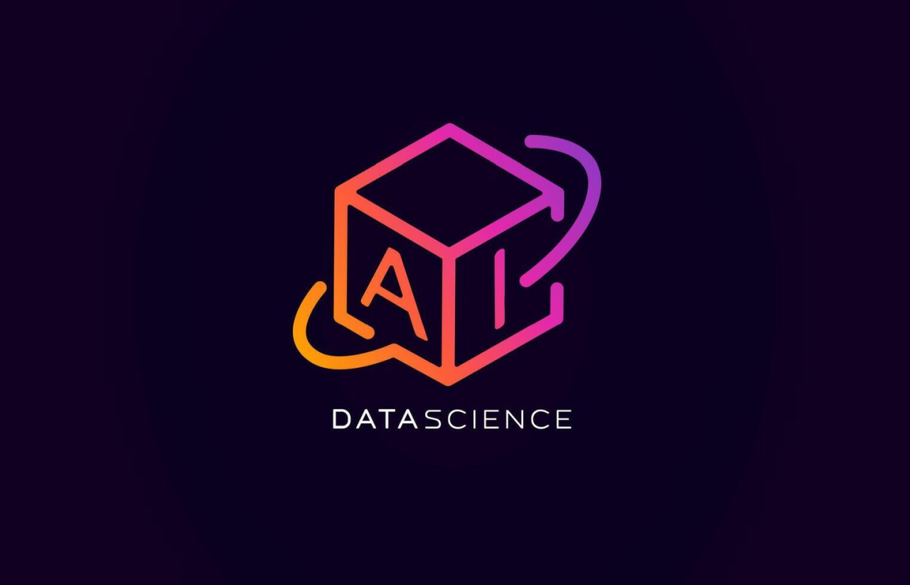

<div align="center">



# 🤖 AI-Marketing-Predictor

### AI-Powered Marketing Analytics & Campaign Intelligence Platform

[](https://python.org)
[](https://streamlit.io)
[](https://scikit-learn.org)
[](https://plotly.com)
[](LICENSE)

**[🔗 Live Demo](https://ai-marketing-predictor.streamlit.app/) &nbsp;|&nbsp; [📂 GitHub](https://github.com/Shadyadief/AI-Marketing-Predictor) &nbsp;|&nbsp; [👤 LinkedIn](https://www.linkedin.com/in/shadya-dief-ml/)**

---

</div>

## 📌 Overview

**AI-Marketing-Predictor** is an end-to-end intelligent dashboard that transforms raw marketing campaign data into actionable insights — powered by Machine Learning.

It doesn't just **show** data. It tells you **what to do** with it.

> Built by **ENG. Shadya Dief** — Data Scientist & Machine Learning Engineer

---

## ✨ Key Features

| Feature | Description |
|---|---|
| 📊 **Overview Dashboard** | Real-time KPIs — Clicks, Impressions, ROI, CTR |
| 👤 **Client View** | Individual client performance tracking & analysis |
| 🤖 **AI Insights** | ML-powered recommendations & next month ROI forecast |
| 📁 **Upload Data** | Upload CSV/Parquet files for instant analysis |
| 📄 **PDF Reports** | One-click professional client-ready reports |
| 🌐 **Bilingual** | Full Arabic & English support (AR/EN) |
| 🎨 **Themes** | Dark & Light mode with glass-morphism design |
| 📱 **Responsive** | Fully optimized for mobile & desktop |

---

## 🤖 Machine Learning Model

- **Algorithm:** Random Forest Classifier
- **Accuracy:** 72% prediction accuracy on campaign success
- **Key Features:**

```
Engagement_Score   →  33% importance
CTR                →  31% importance  
Channel_Used       →  18% importance
```

- **Impact:** Helps reduce marketing budget waste by up to **40%**

---

## 🛠️ Tech Stack

```python
Language     : Python 3.10+
Dashboard    : Streamlit
ML Model     : Scikit-learn (Random Forest)
Visualization: Plotly
Data         : Pandas, NumPy
PDF Reports  : ReportLab
Deployment   : Streamlit Cloud
Version Ctrl : Git / GitHub
```

---

## 📁 Project Structure

```
AI-Marketing-Predictor/
│
├── app.py                    # Main application entry point
├── requirements.txt          # Python dependencies
│
├── assets/
│   ├── logo.png              # Project logo
│   └── style.css             # Custom CSS styling
│
├── data/
│   └── campaigns_clean.parquet   # Cleaned dataset
│
├── models/
│   ├── campaign_model.pkl    # Trained ML model
│   ├── features.pkl          # Feature names
│   └── encoders.pkl          # Label encoders
│
└── modules/
    ├── overview.py           # Overview dashboard page
    ├── client_view.py        # Client analysis page
    ├── ai_insights.py        # AI insights & predictions page
    ├── data_upload.py        # Data upload page
    ├── pdf_report.py         # PDF report generator
    └── translator.py         # AR/EN translations
```

---

## 🚀 Getting Started

### 1. Clone the Repository

```bash
git clone https://github.com/Shadyadief/AI-Marketing-Predictor.git
cd AI-Marketing-Predictor
```

### 2. Install Dependencies

```bash
pip install -r requirements.txt
```

### 3. Run the App

```bash
streamlit run app.py
```

### 4. Open in Browser

```
http://localhost:8501
```

---

## 📊 Dataset

- **Source:** [Marketing Campaign Performance Dataset — Kaggle](https://www.kaggle.com/)
- **Size:** 200,000+ rows
- **Features:** 16 columns including Clicks, Impressions, ROI, Channel_Used, Campaign_Goal, Customer_Segment

---

## 📈 Results

```
✅ 72% prediction accuracy
✅ 200,000+ campaigns analyzed  
✅ 40% better ROI tracking efficiency
✅ Bilingual support (AR / EN)
✅ Live demo accessible globally
```

---

## 🎨 Design System

| Element | Color |
|---|---|
| Primary | `#E91E8C` (Pink/Magenta) |
| Secondary | `#FF6B35` (Orange) |
| Accent | `#9C27B0` (Purple) |
| Background | `#12062A` (Dark Purple) |

---

## 📄 License

This project is licensed under the **MIT License** — see the [LICENSE](LICENSE) file for details.

---

<div align="center">

**Built with ❤️ by ENG. Shadya Dief**

[](https://www.linkedin.com/in/shadya-dief-ml/)
[](https://github.com/Shadyadief)

*Data Scientist | Machine Learning Engineer*

</div>
